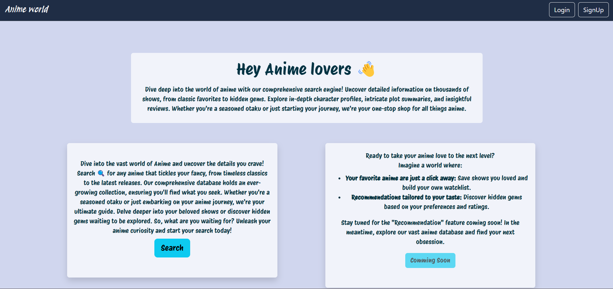
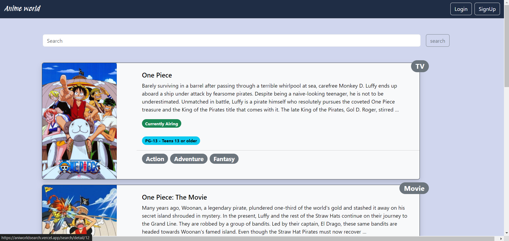
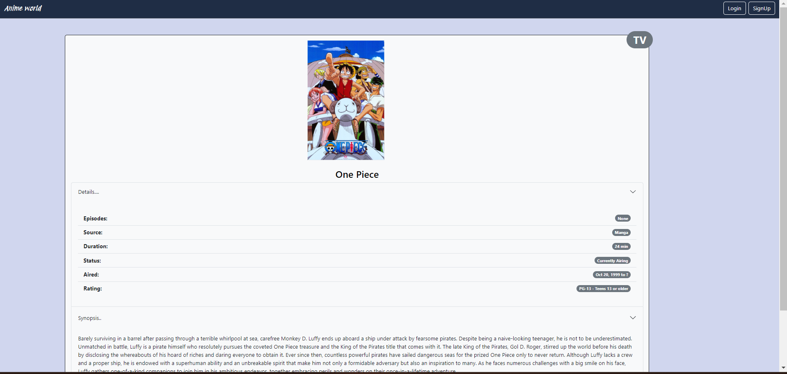

# AniWorld: Prepare to Fall Down the Rabbit Hole


## Screenshots








## Overview

AniWorld is a captivating Django web application built with love for anime enthusiasts, inviting you to embark on a thrilling journey of discovery and organization. Dive into a bottomless rabbit hole of anime filled with endless possibilities


## Getting Started


Follow these steps to get started with the project.

### 1. Clone the Repository

```bash
gh repo clone chayangirdhar/AniWorld
```
```bash
cd AniWorld
```

### 2. Create and Activate virtual environment using conda

```bash
conda create --name your-env-name
```
```bash
conda activate your-env-name
```

### 3. Install dependencies

```bash
pip install -r requirements.txt
```

### 4. Configuration
Most configurations are in `setting.py`.
I set many `setting` configuration with my environment variables (such as: `SECRET_KEY`, `database`) and they did NOT been submitted to the `GitHub`. You can change these in the code with your own configuration or just add them into your environment variables.

If you want to use `sqlite3` as databse uncomment it in `Animeapp/setting.py` or Modify it with database settings, as following:

```python
DATABASES = {
    'default': {
        'ENGINE': 'django.backend.you.are.using',
        'NAME': 'your_db_name',
        'USER': 'user_name',
        'PASSWORD': 'password',
        'HOST': 'host',
        'PORT': 'port_value',
    }
}
```

Run the following commands in Terminal:
```bash
python manage.py makemigrations
python manage.py migrate
```  

### Create super user

Run command in terminal:
```bash
python manage.py createsuperuser
```

### Html Changes
If you are using personal database schema make sure to change the Html based on the schema of data you are fetching from the database.


### Getting start to run server
Execute: `python manage.py runserver`

Open up a browser and visit: http://127.0.0.1:8000/ , the you will see the blog.


## Additional Information

For more details or customizations, refer to the project's documentation or contact the project maintainers. Enjoy your anime web-app.

Need Front-end designer for this project 
contact 
chayangirdhar@gmail.com 
